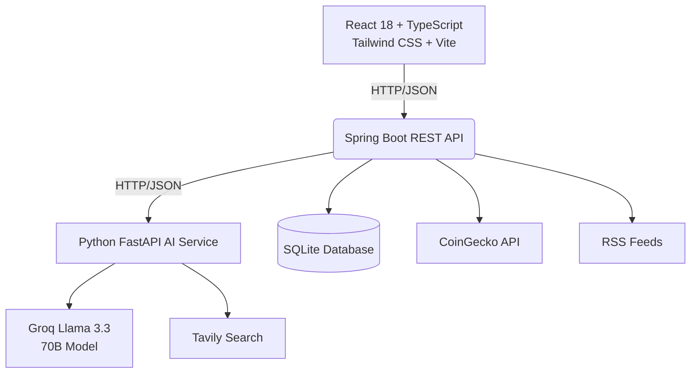
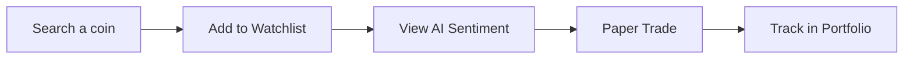

# Crypton — Crypto Market Dashboard

<div align="center">


### Senior Capstone Project

<!-- If deployed, swap this for a real link/badge, e.g.:
[](https://your-deployment-url.com)
-->

<!--
  Add a hero screenshot or short demo GIF here — this is the single highest-impact
  addition you can make. A 5–10s screen recording of the dashboard (prices ticking,
  a sentiment classification loading, a paper trade executing) converts browsers
  into readers far better than any badge row.
  Example:
  
-->

</div>

**Crypton** is a full-stack cryptocurrency analytics platform built as a Senior Capstone project. The application provides live cryptocurrency market data, historical price charts, secure multi-factor authentication (TOTP), personalized watchlists, cryptocurrency comparisons, curated news from trusted industry sources, AI-powered sentiment analysis, paper trading simulation, portfolio tracking with average-cost basis, DCA calculators, tax estimators, and crypto regulatory information across global jurisdictions. The project demonstrates modern React development, REST API integration, responsive UI design, Twelve-Factor App principles, and a three-tier architecture spanning Java Spring Boot, Python FastAPI, and React + TypeScript.

---

## Table of Contents

- [Live Market Data](#live-market-data)
- [Features](#features)
- [Tech Stack](#tech-stack)
- [Architecture](#architecture)
- [Installation](#installation)
- [Environment Variables](#environment-variables)
- [Available Scripts](#available-scripts)
- [Data Sources](#data-sources)
- [Authentication](#authentication)
- [Backend Integration](#backend-integration)
- [Project Structure](#project-structure)
- [Design System](#design-system)
- [Why I Built This](#why-i-built-this)
- [Known Limitations](#known-limitations)
- [Future Enhancements](#future-enhancements)
- [Team](#team)

---

## Live Market Data


---

## Features

### Market Data & Analytics

- 📈 **Live cryptocurrency prices** from CoinGecko API (server-side proxy with 60s in-memory caching)
- 🔍 Search over thousands of cryptocurrencies by name or ticker
- 📊 Advanced price + volume charts with 24H / 7D / 30D / 1Y / Max ranges via Recharts
- 🌍 **Market overview** — global market cap, BTC/ETH dominance, top gainers & losers

### AI-Powered Insights (Python FastAPI Backend)

- 🤖 **AI market sentiment analysis** using Groq's Llama 3.3 70B model — Bullish/Neutral/Bearish classification with confidence scores, catalysts & risks
- 📰 News aggregation from CoinDesk, CoinTelegraph, Decrypt, Bitcoin Magazine, Blockworks, and CryptoSlate RSS feeds
- 🧠 AI article analysis: downloads articles via `newspaper3k`, falls back to Tavily search when content is insufficient
- 🎯 **Crypto personality quiz** — answers a quiz and receives personalized coin recommendations based on investor personality type

### Portfolio & Trading

- 💼 **Portfolio tracker** — full transaction history, average-cost basis (weighted), live P/L per holding and total, allocation donut chart
- 🎮 **Paper trading simulator** — $100k virtual cash, live-price order fills at 60s intervals, positions with cost averaging, real-time P/L tracking
- 🔔 **Price alerts** — above/below target prices polled every minute while the app is open, with browser push notifications

### Tools & Utilities

- 🧮 **DCA Calculator** — historical dollar-cost averaging projections with configurable frequency (weekly/biweekly/monthly) and duration
- 💱 **Crypto/Fiat Converter** — convert between 7 fiat currencies (USD, EUR, GBP, JPY, CAD, AUD, CHF) and any supported cryptocurrency
- 🧾 **Tax Estimator** — estimate short-term vs. long-term capital gains tax based on US federal rates (22% / 15%)
- 📤 **CSV export** for watchlist, portfolio transactions, paper trading history, and trade logs

### Information & Education

- ⚖️ **Exchange comparison platform** — curated list of exchanges with filter tabs: All, Popular, Advanced, Low Fee, DeFi/DEX
- 📜 **Global crypto regulations** — jurisdiction-by-jurisdiction breakdowns (US, EU, UK, Japan, Singapore, etc.) with legal status, key points, tax treatment, and official resource links
- 📚 **Learn center** — expandable guide cards covering wallets, exchanges, DeFi, security, staking, NFTs, and more

### Authentication & User Experience

- 🔐 **Multi-Factor Authentication (TOTP)** with brute-force lockout protection
- 👤 User profiles with persistent search history
- ⭐ Personal watchlist with persistent storage via Spring Boot backend
- 💬 **Forgot password** flow with MFA verification
- 🌙 Dark/Light theme support and a fully responsive interface across all screen sizes

### Testing & Quality

- ✅ Vitest unit tests for portfolio average-cost math, paper trading buy/sell logic, CSV export formatting, and more

---

## Tech Stack

<details>
<summary><strong>Frontend</strong></summary>

| Technology | Version | Purpose |
|-----------|---------|---------|
| React | 18.3 | UI framework with hooks and context |
| TypeScript | 5.4+ | Type-safe development |
| Vite | 5.2 | Fast build tool and dev server |
| Tailwind CSS | 3.4 | Utility-first responsive styling |
| React Router | v6.23 | Client-side routing with protected routes |
| Recharts | 2.12 | Declarative charting (price/volume, allocation donut) |
| Lucide React | 0.383 | Icon library |
| otpauth | 9.5 | TOTP secret generation for MFA setup |
| qrcode.react | 4.2 | QR code rendering for MFA setup |

</details>

<details>
<summary><strong>Backend — Java Spring Boot</strong></summary>

| Technology | Version | Purpose |
|-----------|---------|---------|
| Spring Boot | 3.2 | REST API framework |
| Spring Data JPA | — | ORM with Hibernate |
| SQLite | 3.44 | Embedded database for user data, watchlists, sentiment cache |
| Jackson | — | JSON serialization/deserialization |
| dev.samstevens.totp | 1.7.1 | TOTP secret generation and verification |

</details>

<details>
<summary><strong>Backend — Python FastAPI (AI Service)</strong></summary>

| Technology | Version | Purpose |
|-----------|---------|---------|
| FastAPI | 0.116+ | Async REST API for AI analysis |
| Uvicorn | 0.35+ | ASGI server |
| Groq SDK | 0.9+ | Llama 3.3 70B inference (sentiment + personality quiz) |
| Tavily | 0.3+ | Semantic news search fallback |
| newspaper3k | 0.28+ | Article text extraction from URLs |
| lxml / BeautifulSoup4 | — | HTML parsing for article scraping |

</details>

<details>
<summary><strong>Environment & Dev Tools</strong></summary>

| Tool | Purpose |
|------|---------|
| Vitest | Frontend unit test runner (CSV, portfolio math, paper trading) |
| Maven | Java build tool and dependency manager |
| pip / venv | Python package management |

</details>

---

## Architecture

Crypton follows a three-tier architecture with two backend services:



### User Flow



### Data Flow

1. **Market data**: Frontend → Spring Boot `/api/coingecko/*` (server-side proxy with caching) → CoinGecko API
2. **AI sentiment**: Frontend → Python FastAPI `/classify` → Groq Llama 3.3 + Tavily search → result cached in SQLite via Spring Boot `/api/sentiment/{ticker}`
3. **User data**: Frontend ↔ Spring Boot REST endpoints (auth, watchlist) stored in SQLite
4. **News aggregation**: Python FastAPI downloads RSS articles via `newspaper3k`, falls back to Tavily when content is insufficient

---

## Installation

### Prerequisites

- **Node.js 18+** and **npm** (for the frontend)
- **Java 17+** and **Maven** (for the Spring Boot backend — optional, can run without it)
- **Python 3.9+** (for the AI service backend — optional)

### Frontend

```bash
git clone https://github.com/your-repository/crypton.git

cd frontend

npm install

cp .env.example .env

# Edit .env with your API keys and backend URLs, then:

npm run dev
```

The application will be available at:

```
http://localhost:5173
```

### Backend — Java Spring Boot (Optional)

```bash
cd backend

mvn spring-boot:run
```

The REST API will be available at `http://localhost:8080` by default.

### Backend — Python FastAPI AI Service (Optional)

```bash
cd backend/python

python -m venv venv
venv\Scripts\activate   # Windows
# or: source venv/bin/activate  # macOS/Linux

pip install -r requirements.txt

cp .env.example .env    # Add your Groq and Tavily API keys

uvicorn main:app --reload
```

The AI service will be available at `http://localhost:8000`.

---

## Environment Variables

Create a `.env` file from `.env.example`.

<details>
<summary><strong>Frontend .env</strong></summary>

| Variable | Description | Default |
|----------|-------------|---------|
| `VITE_API_URL` | Java/Spring Boot backend URL (auth, watchlist, CoinGecko proxy, sentiment cache) | — |
| `VITE_PYTHON_API_URL` | Python/FastAPI AI service URL (`/classify`, `/personality-quiz`) | — |
| `VITE_APP_NAME` | Application name displayed in the UI | Crypton |

</details>

<details>
<summary><strong>Backend — Spring Boot (Optional)</strong></summary>

| Variable | Description | Default |
|----------|-------------|---------|
| `COINGECKO_API_KEY` | CoinGecko API key for server-side proxy requests | Demo key included |
| `DB_URL` | SQLite database URL | `jdbc:sqlite:./crypton.db` |

</details>

<details>
<summary><strong>Backend — Python FastAPI (Optional)</strong></summary>

| Variable | Description | Required |
|----------|-------------|----------|
| `GROQ_API_KEY` | Groq API key for Llama 3.3 inference | ✅ Yes |
| `TAVILY_API_KEY` | Tavily search API key for news fallback | Recommended |

</details>

---

## Available Scripts

### Frontend (`frontend/`)

```bash
npm run dev
```

Starts the Vite development server with hot module replacement at `http://localhost:5173`.

```bash
npm run build
```

Compiles TypeScript and creates a production-optimized build in `dist/`.

```bash
npm run preview
```

Serves the production build locally for testing.

```bash
npm test
```

Runs the Vitest unit suite covering CSV export formatting, portfolio average-cost math, paper trading buy/sell logic, and more. Also runs in CI on every push and PR.

### Backend — Spring Boot (`backend/`)

```bash
mvn spring-boot:run
```

Starts the Java REST API server at `http://localhost:8080`.

### Backend — Python FastAPI (`backend/python/`)

```bash
uvicorn main:app --reload
```

Starts the AI service at `http://localhost:8000` with auto-reload during development.

---

## Data Sources

### Market Data

| Source | Type | Purpose |
|--------|------|---------|
| **CoinGecko API** | REST (v3) | Live prices, market charts, search, trending coins |
| **CryptoCompare API** | REST | Alternative price data with higher rate limits |

### News & Sentiment

| Source | Type | Purpose |
|--------|------|---------|
| CoinDesk RSS | Feed | Major crypto news aggregation |
| CoinTelegraph RSS | Feed | Industry analysis and market updates |
| Decrypt RSS | Feed | DeFi-focused news coverage |
| Bitcoin Magazine RSS | Feed | Bitcoin-specific reporting |
| Blockworks RSS | Feed | Institutional crypto insights |
| CryptoSlate RSS | Feed | Market data and regulatory news |

### AI Analysis Pipeline

1. **Article Download**: Python FastAPI uses `newspaper3k` to extract readable text from RSS article URLs
2. **Fallback Search**: If articles contain insufficient content (< 500 chars), Tavily semantic search retrieves additional relevant articles
3. **AI Classification**: Groq's Llama 3.3 70B model analyzes all collected articles and returns:
   - Overall sentiment classification (Bullish/Neutral/Bearish)
   - Confidence score (0-100%)
   - Market score (-100 to +100)
   - Bullish catalysts and bearish risks
   - Short-term and long-term outlook
4. **Caching**: Results are stored in SQLite via Spring Boot's sentiment cache endpoint for reuse

---

## Authentication

Crypton implements secure two-factor authentication using Time-based One-Time Passwords (TOTP) with a multi-step login flow.

### Security Measures

| Feature | Implementation |
|---------|---------------|
| **Password Hashing** | PBKDF2 with SHA-256 for strong password storage |
| **MFA Setup** | TOTP secret generation via `dev.samstevens.totp` library, QR code rendering with `qrcode.react` |
| **Login Flow** | Two-step process: Step 1 verifies username/password, Step 2 verifies MFA token |
| **Brute-Force Protection** | Account lockout after repeated failed login attempts |
| **Password Reset** | Secure reset flow requiring MFA verification before allowing password change |

### Login Steps

1. **Step 1**: User enters username and password → server validates credentials
2. **Step 2**: Server sends TOTP code to user's authenticator app → user verifies with MFA token
3. **Success**: User is authenticated and can access protected routes

### Setup Flow

1. New users register with a generated MFA secret (displayed as QR code)
2. Users scan the QR code with an authenticator app (Google Authenticator, Authy, etc.)
3. Users enter a test TOTP code to complete setup
4. From then on, every login requires both password and current TOTP code

---

## Backend Integration

Setting `VITE_API_URL` and `VITE_PYTHON_API_URL` automatically routes frontend requests to the appropriate backend services without modifying application code.

<details>
<summary><strong>Spring Boot REST Endpoints (/api/auth)</strong></summary>

| Method | Endpoint | Description |
|--------|----------|-------------|
| `GET` | `/health` | Service health check |
| `GET` | `/mfa/setup/{username}` | Generate MFA secret + QR code for setup |
| `POST` | `/register` | Register new user with email, password, and optional MFA |
| `POST` | `/login/step1` | Verify username and password (first step of login) |
| `POST` | `/login/step2` | Verify TOTP code (second step of login) |
| `POST` | `/reset-password` | Reset password with MFA verification |
| `GET` | `/watchlist/{username}` | Get user's watchlist coins |
| `POST` | `/watchlist/{username}` | Update user's watchlist coins |

</details>

<details>
<summary><strong>Spring Boot CoinGecko Proxy (/api/coingecko)</strong></summary>

All requests are forwarded server-to-server to avoid CORS issues from GitHub Pages:

| Method | Endpoint | Upstream | Description |
|--------|----------|----------|-------------|
| `GET` | `/markets` | `/coins/markets` | Live market data (prices, volumes, changes) |
| `GET` | `/market_chart/{id}` | `/coins/{id}/market_chart` | Historical price + volume charts |
| `GET` | `/search` | `/search` | Search cryptocurrencies by name/ticker |

**60-second in-memory caching** reduces CoinGecko API calls when multiple clients request the same data.

</details>

<details>
<summary><strong>Spring Boot Sentiment Cache (/api/sentiment)</strong></summary>

| Method | Endpoint | Description |
|--------|----------|-------------|
| `GET` | `/sentiment/{ticker}` | Get cached AI sentiment for a coin |
| `POST` | `/sentiment/{ticker}` | Save AI sentiment result to SQLite database |
| `GET` | `/sentiment` | Get all cached sentiments |

</details>

<details>
<summary><strong>Python FastAPI Endpoints (/api)</strong></summary>

| Method | Endpoint | Description |
|--------|----------|-------------|
| `GET` | `/` | Service health check |
| `GET` | `/test` | Test Groq connectivity (returns "Hello!") |
| `POST` | `/classify` | Analyze cryptocurrency news articles → sentiment + outlook |
| `POST` | `/personality-quiz` | Process quiz answers → investor personality type + coin recommendations |

</details>

### Supported Coins for AI Analysis

Bitcoin, Ethereum, Solana, XRP, Dogecoin, Cardano, Avalanche, Chainlink, Polkadot, Litecoin, Binance Coin, Shiba Inu, Uniswap

---

## Project Structure

<details>
<summary><strong>Click to expand full project structure</strong></summary>

```text
SeniorProject/
├── start.ps1                          # PowerShell startup script for local development
├── .env.example                       # Environment variable template (never commit)
├── README.md                          # This file
│
├── frontend/                          # React 18 + TypeScript application (Vite)
│   ├── src/
│   │   ├── components/                # Reusable UI components
│   │   │   ├── CoinCard.tsx           # Individual coin display card with price/change
│   │   │   ├── ErrorBoundary.tsx      # React error boundary for graceful failure handling
│   │   │   ├── MarketOverview.tsx     # Global market stats (cap, dominance, top movers)
│   │   │   ├── Navbar.tsx            # Navigation bar with theme toggle and user menu
│   │   │   ├── NewsCard.tsx          # Individual news article card
│   │   │   ├── ProtectedRoute.tsx    # Route guard requiring authentication
│   │   │   ├── SearchBar.tsx         # Coin search input with live results
│   │   │   ├── Skeleton.tsx          # Loading skeleton placeholders
│   │   │   └── TickerStrip.tsx       # Horizontal ticker tape of trending coins
│   │   ├── context/                   # React Context providers for global state
│   │   │   ├── AlertsContext.tsx      # Price alert management and browser notifications
│   │   │   ├── AppContext.tsx         # Global app settings (theme, display currency)
│   │   │   ├── AuthContext.tsx        # Authentication state and login/logout flow
│   │   │   ├── FeatureProviders.tsx   # Feature flag provider
│   │   │   ├── PaperTradingContext.test.ts  # Unit tests for paper trading logic
│   │   │   ├── PaperTradingContext.tsx    # Virtual cash, positions, buy/sell operations
│   │   │   ├── PortfolioContext.test.ts     # Unit tests for portfolio math
│   │   │   ├── PortfolioContext.tsx        # Transaction history, holdings, P/L calculations
│   │   │   └── SavedNewsContext.tsx        # Bookmarked articles persistence
│   │   ├── lib/                       # Utility modules and data mappings
│   │   │   ├── api.ts                 # API client with request/response types
│   │   │   ├── apiRequest.ts          # HTTP request helper (fetch wrapper)
│   │   │   ├── auth.ts                # Authentication helpers (token management)
│   │   │   ├── coinDescriptions.ts    # Coin name/ticker mapping data
│   │   │   ├── coinMapping.ts         # Full COINS array with metadata for AI analysis
│   │   │   ├── csv.test.ts            # Unit tests for CSV export formatting
│   │   │   ├── csv.ts                 # CSV download utility (watchlist, portfolio, trades)
│   │   │   ├── displayCurrency.ts     # Multi-currency formatting (USD/EUR/GBP/JPY/BTC/ETH)
│   │   │   ├── exchangeData.ts        # Exchange platform data with tags and descriptions
│   │   │   ├── learnData.ts           # Educational guide content for Learn page
│   │   │   ├── logger.ts              # Logging utility
│   │   │   ├── rateLimit.ts           # Rate limiting helpers for API calls
│   │   │   ├── regulationData.ts      # Global crypto regulatory data by jurisdiction
│   │   │   └── useTheme.ts            # Theme hook (dark/light toggle)
│   │   └── pages/                     # Page-level components (one per route)
│   │       ├── Alerts.tsx             # Price alert setup and triggered alerts list
│   │       ├── CoinPage.tsx           # Individual coin detail page with charts & sentiment
│   │       ├── Compare.tsx            # Side-by-side 2-coin comparison
│   │       ├── Exchanges.tsx          # Exchange platform directory with filters
│   │       ├── ForgotPassword.tsx     # Password reset flow with MFA verification
│   │       ├── Home.tsx               # Landing page with market overview & trending coins
│   │       ├── Learn.tsx              # Expandable educational guide cards
│   │       ├── Login.tsx              # Two-step login (password + TOTP)
│   │       ├── News.tsx               # News feed with source/keyword filters and bookmarks
│   │       ├── PaperTrading.tsx       # Virtual cash trading simulator ($100k starting balance)
│   │       ├── Portfolio.tsx          # Transaction history, holdings, P/L, allocation donut
│   │       ├── Profile.tsx            # User profile with search history
│   │       ├── Register.tsx           # Registration with MFA setup (QR code)
│   │       ├── Regulations.tsx        # Global crypto regulatory information by jurisdiction
│   │       ├── Results.tsx            # Quiz results display
│   │       ├── Tools.tsx              # DCA calculator, currency converter, tax estimator
│   │       └── Watchlist.tsx          # Starred coins list with persistent storage
│   ├── public/                        # Static assets and 404.html SPA fallback
│   ├── package.json                   # Dependencies: React, Recharts, Lucide, otpauth, qrcode.react
│   ├── vite.config.ts                 # Vite config with path aliases (@) and base URL
│   ├── tsconfig.json                  # TypeScript strict configuration
│   ├── tsconfig.node.json             # Node-specific TS config for Vite plugins
│   ├── vitest.config.ts               # Vitest test runner configuration
│   └── tailwind.config.js             # Tailwind theme (navy, orange accent, green/red indicators)
│
├── backend/                           # Java Spring Boot + Python FastAPI backends
│   ├── pom.xml                        # Maven config: Spring Boot 3.2, JPA, SQLite, TOTP library
│   │
│   └── src/main/java/com/crypton/     # Spring Boot application code
│       ├── CryptonApplication.java    # @SpringBootApplication entry point
│       ├── config/CorsConfig.java     # CORS whitelist for frontend origins
│       │
│       └── controller/                # REST API controllers
│           ├── AuthController.java    # 8 endpoints: health, MFA setup, register, login (2-step), reset-password, watchlist CRUD
│           ├── CoinGeckoController.java  # Server-side proxy with 60s in-memory cache
│           ├── SentimentCacheController.java     # GET/POST sentiment for individual coins + all cached
│           └── SentimentCacheTopController.java  # Top coin by market score
│       │
│       ├── model/                     # JPA entity classes
│       │   ├── CoinSentimentCache.java    # AI sentiment result stored in SQLite
│       │   └── User.java                  # User account with username, email, password hash, MFA secret
│       │
│       ├── repository/                # Spring Data JPA repositories
│       │   ├── CoinSentimentCacheRepository.java
│       │   └── UserRepository.java
│       │
│       └── service/                   # Business logic layer
│           ├── AuthService.java        # Registration, login (2-step), password reset, watchlist management
│           ├── MfaService.java         # TOTP secret generation and verification
│           └── SentimentCacheService.java  # Cache get/set/top queries for AI sentiment results
│       │
│   ├── src/main/resources/            # Spring Boot configuration files
│   │   └── application.properties     # Database URL, server port, CoinGecko API key
│   │
│   └── python/                        # Python FastAPI AI service (port 8000)
│       ├── main.py                    # Full FastAPI app: /classify, /personality-quiz, /test endpoints
│       ├── requirements.txt           # Dependencies: fastapi, uvicorn, groq, tavily-python, newspaper3k, lxml, bs4
│       ├── Procfile                   # Heroku deployment configuration (web: uvicorn main:app)
│       └── instructions.md            # Step-by-step setup guide for the AI backend
```

### Key Files Explained

| File | Purpose |
|------|---------|
| `start.ps1` | PowerShell script to start both Spring Boot and FastAPI backends in parallel |
| `.env.example` | Template for all required environment variables (frontend + both backends) |
| `frontend/src/lib/coinMapping.ts` | Central coin metadata: ticker, name, description, category — used by AI analysis, search, and display |
| `backend/python/main.py` | Groq Llama 3.3 inference pipeline with Tavily fallback for news sentiment analysis |

</details>

---

## Design System

Crypton uses a custom Tailwind CSS theme with the following color palette:

| Token | Hex Value | Usage |
|-------|-----------|-------|
| Navy | `#08080F` | Primary page background (dark theme) |
| Surface | `#0F0F1A` | Card and panel backgrounds |
| Border | `#21213A` | Borders, dividers, and outlines |
| Orange Accent | `#F7931A` | Primary buttons, links, highlights, alert notifications |
| Bullish Green | `#00E676` | Positive price changes, gains, profit indicators |
| Bearish Red | `#FF3355` | Negative price changes, losses, loss indicators |
| Watchlist Gold | `#FFB020` | Favorite/watchlist star indicators |
| Muted Gray | `#5A5A7A` | Secondary text and icons |
| White | `#FFFFFF` | Primary text on dark backgrounds |

### Typography & Spacing

- **Font**: System font stack (San Francisco, Segoe UI, Roboto)
- **Border radius**: 8–12px for cards and panels
- **Section padding**: 5rem vertical with 1.5rem horizontal
- **Responsive breakpoints**: Mobile-first with `md:` and responsive clamp() values

---

## Why I Built This

<!--
  A short reflection section — 3-5 sentences on what motivated the project,
  what you wanted to learn (three-tier architecture? AI integration? MFA?),
  and what you're most proud of. This is the part that makes a capstone README
  read like a person wrote it instead of a spec sheet. Fill in your own take.
-->

---

## Known Limitations

<!--
  Pairs with Future Enhancements below — shows you understand the tradeoffs
  in your own system. A few starting candidates pulled directly from the
  Future Enhancements list and the app's current design:
-->

- No server-side session tokens yet — per-user endpoints currently rely on local storage rather than authenticated sessions
- Price and alert data is polled on an interval rather than pushed via WebSocket, so updates can lag by up to 60 seconds
- AI sentiment analysis is currently limited to the 13 coins listed in `coinMapping.ts`
- No automated end-to-end test coverage yet (component/E2E tests are Vitest-only, unit-level)

---

## Future Enhancements

- [ ] Server-side session tokens so per-user endpoints are authenticated (currently uses local storage)
- [ ] TradingView-grade charting library for advanced technical analysis indicators
- [ ] Native mobile application (React Native or Flutter)
- [ ] Installable PWA with offline support and service worker caching
- [ ] Wider automated test coverage: component tests, E2E tests with Playwright/Cypress
- [ ] WebSocket real-time price updates instead of polling
- [ ] Multi-language/i18n support
- [ ] CoinGecko Pro API integration for higher rate limits

---

## Team

<div align="center">

| <br>[Ahmed I.](https://github.com/a-iqbal02) | <br>[Jon Z.](https://github.com/JonPaul007) | <br>[Umar](https://github.com/mq-umar) | <br>[Derek Z.](https://github.com/DerekZac) | <br>[Ryan C.](https://github.com/ryguy0601) |
|:---:|:---:|:---:|:---:|:---:|

</div>
